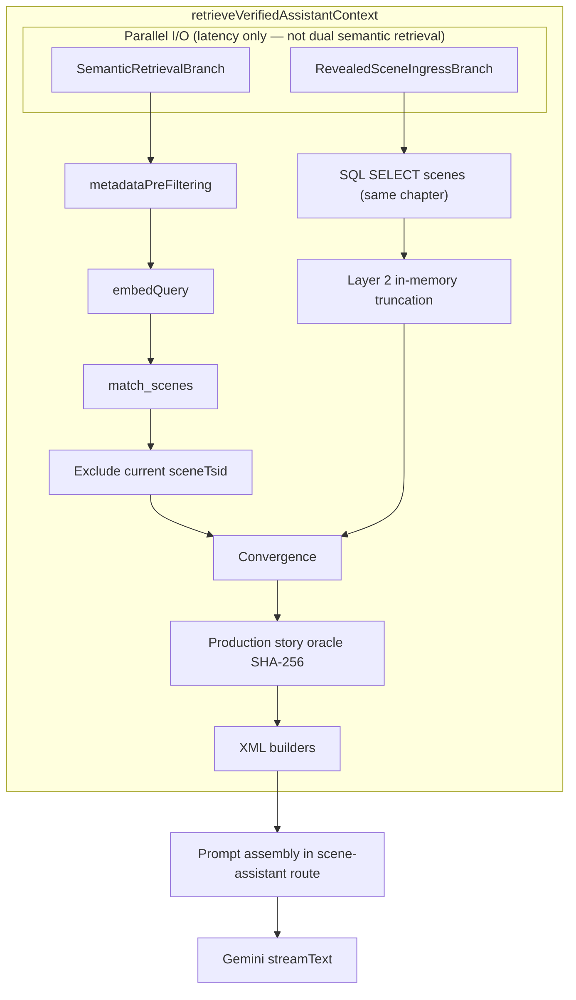

# ADR-002: Hybrid RAG with Two-Layer Visibility Boundary

> **Vocabulary Notice:** This document uses implementation symbols (`Scene`, `sceneTsid`, `story_images_v2`,
> `caption`, `order_index`). Normative Runtime vocabulary is `Reading Route` (impl: Scene) and
> `Reading Frame` (impl: Story Images). See `governance/vocabulary/runtime-lexicon.md` in `raree-show-admin`.

## Context

### Current limitation

The Scene Assistant initially relied on a static retrieval scope. The system could not answer questions that depend on which scenes the reader is allowed to know about, and could not bind model-visible narrative to the reader’s actual position in the work.

### Specifically

1. Cross-scene questions (e.g. where a character appeared earlier) were not supported by a scoped retrieval universe.
2. Responses could include narrative the reader has not yet reached (spoiler risk).

### Prior state

- Phase 1 delivered embedding backfill in CMS and a debug retrieval endpoint; that endpoint was not yet part of the Scene Assistant runtime.
- The product requires query-aware retrieval scope and **non-bypassable limits on how narrative and progress propagate** through the Scene Assistant pipeline (retrieval stage vs prompt/token stage).

### Need

- The Scene Assistant must use retrieval scope that reflects the reader’s progress and the active scene.
- Spoiler isolation must be enforced **independently of model compliance**: boundaries are system guarantees, not prompts asking the model to behave.

### Constraints (from product and system requirements)

- SQL filtering is a **mandatory** step before vector similarity runs; vector search must not widen visibility beyond SQL-approved scene candidates.
- Vector semantic reranking is **mandatory** on every query that uses hybrid retrieval; it always runs on SQL output.
- The retrieval topology remains a **single serial pipeline**: SQL filter, then vector rerank. No routing that skips SQL. No branch that runs vector without SQL first.
- Story-level spoiler control for the **current** scene must not rely on sending full captions and instructing the model to ignore unread slides.

---

## Decision

### Hybrid RAG serial pipeline

Hybrid RAG is a **two-stage serial pipeline**.

1. **SQL retrieval (`metadataPreFiltering`)** acts as the mandatory safety gate. It builds the candidate set of scenes the reader may retrieve against, using `chapter_number` and `order_index` with lexicographic “read up to” semantics tied to committed progress (`readUpToChapter`, `readUpToOrderIndex`).
2. **Vector retrieval (`match_scenes`)** performs semantic reranking **only** on that candidate set. Vector operates on SQL output; it does not introduce scenes outside the SQL-approved set.

**Topology (mandatory):**

```text
SQL filter → vector rerank
```

This is not routing. This is not conditional fallback.

---

### Scene Assistant ingress topology (deployed)

Scene Assistant ingress is implemented in `retrieveVerifiedAssistantContext` (`src/services/retrieval.ts`). Two I/O paths run **in parallel for latency** via `Promise.all`; they **converge** before the function returns (production oracle + XML builders). This is **not** dual semantic retrieval.



**Branch A — semantic retrieval** (`retrieveScenesUncached`):

* Serial hybrid path: SQL gate → embed → `match_scenes` vector rerank.
* Query-dependent.
* Current scene (`sceneTsid`) is excluded from results before prompt assembly to avoid whole-scene RAG text bypassing story truncation.

**Branch B — deterministic revealed-scene ingress** (`fetchChapterScenesWithinProgress`):

* SQL read from `scenes` (same chapter, within progress bounds) plus Layer 2 in-memory caption truncation.
* **No** embedding, **no** `match_scenes`, **not** query-dependent.
* **Not** vector retrieval, **not** a hybrid retrieval branch.

**Trust semantics:**

| Source | Role | Oracle authority | Query-dependent |
|--------|------|------------------|-----------------|
| `chapterScenes` (Branch B) | Authoritative revealed-state grounding | Yes — gates LLM ingress | No |
| `results` after rerank (Branch A, current scene excluded) | Supplementary semantic context in `<context>` | No | Yes |

Prompt assembly in `src/app/api/scene-assistant/route.ts` combines: current-scene revealed XML, same-chapter revealed-scene XML (Branch B), and semantic `<context>` (Branch A).

---

### Visibility Boundary (Phase 3) — definition

**Visibility Boundary** is the **maximum propagation scope** for narrative and progress information **through the Scene Assistant pipeline**—from retrieval through prompt assembly to the LLM. It is **not** a single “model-visible” ceiling for every stage: Layer 1 governs **retrieval-visible** scope (which scenes may enter hybrid search), while Layer 2 governs **model-visible tokens** for specific narrative units (slide captions) in the current scene. Spoiler isolation is enforced independently of model compliance at each stage.

**Narrative atoms:** The smallest narrative fragments that Layer 2 addresses for spoiler control—here, the per-slide **caption** for each entry in the **effective story list** derived from `story_images_v2`, in array order. Other system-prompt fields (scene title, summary, location, etc.) are governed separately; unless stated otherwise, **narrative atom** means one such slide-level caption.

#### Layer 1 — Retrieval Visibility Boundary (SQL Gate)

The Retrieval Visibility Boundary is enforced during **`metadataPreFiltering`**. It constrains **retrieval-visible** scope (candidate scenes for hybrid search). It is **not** the same as Layer 2’s model-token ceiling; scenes may be retrieval-eligible while only a slice of the current scene’s **narrative atoms** is model-visible.

**Responsibilities:**

- Scene-level physical isolation of the retrieval universe.
- Upper bound on the candidate set before vector reranking.
- Semantic retrieval safety gate: only SQL-approved scenes enter the retrieval universe.

**Mandatory constraints:**

- `match_scenes` operates **only** on SQL-approved candidates.
- Vector retrieval does **not** expand visibility beyond that set.

#### Layer 2 — Prompt Visibility Boundary (in-memory truncation)

The Prompt Visibility Boundary is enforced during **prompt assembly** after retrieval completes and **before** any LLM call.

**Responsibilities:**

- Story-level logical isolation within the current scene.
- Token-level spoiler prevention for **narrative atoms** (slide captions from `story_images_v2` in effective story order).
- Partial visibility for the **current** scene only.

**Retrieval independence:** Layer 2 truncation is applied on the **revealed-scene ingress** path (Branch B). It does **not** change vector rerank inputs, the SQL candidate set, or rankings. Parallel I/O via `Promise.all` does **not** make Branch B a second semantic retrieval pipeline. Prompt-side truncation **does not** add or remove scenes from the SQL-approved universe, **does not** alter **retrieval recall** of scenes. It only limits which **narrative atom** texts from authorized scene rows become **model-visible tokens**.

**Current-scene rule:**

For the current scene (`sceneTsid`), only narrative atoms with indices **`0..readUpToStoryIndexLast`** (inclusive) may appear in model-visible tokens. Unread captions must **never** appear in those tokens.

**Architectural role:**

Layer 2 is **downstream prompt construction** over an already authorized retrieval scope. It is **not** semantic retrieval, **not** a second retrieval pipeline, **not** chapter retrieval, and **not** cross-scene retrieval in the ADR-002 sense.

**Same-chapter revealed-scene context (terminology):** Prompt-only reads from `scenes` that load `story_images_v2` (after truncation) and related fields for the system prompt are **same-chapter revealed-scene context**.

**Effective story list** (must match the client ImageReel): entries from `story_images_v2` with non-empty trimmed `url`, in array order; `caption` is a string (empty allowed).

**Progress fields (`ProgressConfig` / client mirror):**

- **Retrieval Visibility Boundary state:** `workTsid`, `readUpToChapter`, `readUpToOrderIndex`.
- **Prompt Visibility Boundary state:** `sceneTsid`, `readUpToStoryIndexLast`.

**Product default (locked):** `readUpToStoryIndexLast` aligns with the client carousel index for the **currently visible** slide, inclusive. If there are no slides, the value is **`-1`** and the server reveals **no** story captions for the current scene. The server **clamps** `readUpToStoryIndexLast` to `[-1, effectiveSlideCount - 1]` per scene.

**Model-visible context:** `match_scenes` similarity / score / distance metadata is **excluded** from the model-facing system prompt (server observability may still log it).

---

### Why two layers instead of restructuring SQL for every story slide

- **Stable retrieval topology:** The SQL → vector pipeline stays one branch; no nested retrieval topology for per-slide rows.
- **Token-granular spoiler control:** Story-level visibility is enforced at prompt assembly granularity without fragmenting retrieval into story-chunk queries.
- **Separation of concerns:** Layer 1 answers **which scenes may propagate into retrieval**. Layer 2 answers **which narrative atoms may propagate into model-visible prompt tokens** for the current scene. The two boundaries are orthogonal stages in the same pipeline.

---

### End-to-end invariant (reader ↔ assistant)

**Assistant retrieval must observe committed visibility boundary state.** Each Scene Assistant invocation carries `userProgress` (`ProgressConfig`); `metadataPreFiltering`, `match_scenes`, and prompt assembly treat those fields as authoritative for Layer 1 and Layer 2. The reader client is responsible for committing progress so that payload matches the reader’s actual position; **client sequencing and UI orchestration** are specified in [W-01: Visibility-Synchronized Navigation](../specs/w-01-visibility-synchronized-navigation.md), not in this ADR.

---

## Alternatives

### Routing

- **Definition:** The system chooses SQL-only or vector-only (or skips one step) based on query type or heuristics.
- **Rejection:** This approach does not satisfy the constraint that **SQL is mandatory before vector**, because it makes SQL not a mandatory step for every hybrid retrieval request, which violates “SQL must be a mandatory safety gate (cannot be bypassed).”

### Fallback

- **Definition:** The system runs SQL first; if results are deemed insufficient, it runs vector without the SQL constraint or repeats with a different path.
- **Rejection:** This approach does not satisfy the constraint that **vector always reranks SQL output as the only semantic step**, because it introduces a path where vector does not operate strictly on the SQL-approved candidate set as the sole mandatory downstream step, which violates the serial “SQL filter → vector rerank” topology.

### Pure vector

- **Definition:** Retrieval uses only vector search with no SQL gate.
- **Rejection:** This approach does not satisfy the constraint that **SQL is mandatory**, because it removes the mandatory safety gate, which violates “SQL must be a mandatory safety gate (cannot be bypassed).”

### Second retrieval pipeline for current-scene captions

- **Definition:** A separate retrieval branch loads or ranks story chunks instead of truncating at prompt assembly.
- **Rejection:** This approach does not satisfy the constraint of **a single serial retrieval topology** for scene-level hybrid RAG; Layer 2 is prompt construction over authorized scope, not a parallel retrieval pipeline. **`Promise.all` parallel I/O must not be documented as dual hybrid retrieval** — Branch B is deterministic revealed-scene ingress, not semantic retrieval.

---

## Consequences

### Benefits

- SQL enforces **Retrieval Visibility Boundary** (what may propagate into retrieval); vector improves relevance **within** that set.
- **Prompt Visibility Boundary** governs propagation of **narrative atoms** into model-visible tokens without changing retrieval topology.
- Serial ordering yields **predictable** behavior for debugging and operations.
- The end-to-end **invariant** above ties server boundaries to request payloads; compliant clients (W-01) keep `userProgress` aligned with the reader’s position.

### Trade-offs

- Two-stage retrieval adds **end-to-end latency** versus a single stage.
- Operators and developers incur **higher debugging cost** when separating SQL filter effects from vector rerank effects.
- **Dual-layer** visibility requires discipline in prompt assembly on the server and in how clients submit `userProgress` (see W-01) so Layer 1 and Layer 2 stay consistent end-to-end.

---

## Validation

- **SQL gate:** `match_scenes` is invoked only with candidate tsids produced by `metadataPreFiltering` (no expansion outside that set).
- **Vector on SQL output:** Embedding and RPC operate on the filtered candidate universe for each request.
- **Prompt truncation:** Current-scene `story_images_v2` captions are sliced to `0..readUpToStoryIndexLast` before any LLM invocation.
- **Unread captions (negative guarantee):** For the current scene, **narrative atoms** with index **greater than** `readUpToStoryIndexLast` are **absent** from model-visible tokens—enforced by construction (truncation before the LLM), not by instructing the model to ignore unread slides.
- **Layer 2 vs retrieval recall (negative guarantee):** Verified traces show Layer 2 truncation does not change which scenes are candidates for retrieval or how they are ranked; it only filters prompt text **after** retrieval.
- **Committed boundary on requests:** Scene Assistant API inputs use `userProgress` as the committed visibility boundary snapshot for that turn; client-side ordering and reset semantics are validated under [W-01](../specs/w-01-visibility-synchronized-navigation.md).

---

## Refs

- Retrieval implementation: `src/services/retrieval.ts` (`metadataPreFiltering`, `retrieveScenes`, `retrieveVerifiedAssistantContext`, `fetchChapterScenesWithinProgress`).
- Production story oracle: `src/lib/production-story-oracle.ts`.
- Scene Assistant API: `src/app/api/scene-assistant/route.ts`.
- Client navigation spec: [W-01: Visibility-Synchronized Navigation](../specs/w-01-visibility-synchronized-navigation.md) (`ReadingRouteExperience.tsx`, `useReadingRouteNavigation.ts`).
- Reading frame filtering alignment: `src/lib/reading-frames.ts`.

### Follow-up (granularity)

- Story-level embedding chunks (ADR-001 evolution) if RAG text must align exactly with story boundaries without post-filtering.
