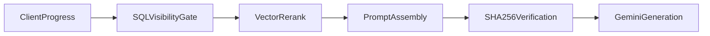

# Raree Show Web — Runtime Implementation Architecture

## Metadata

| Field        | Value                                                                 |
| ------------ | --------------------------------------------------------------------- |
| Status       | **Accepted**                                                          |
| Version      | v2.1                                                                  |
| Last Updated | 2026-07-11                                                            |
| Authority    | How this repository realizes Runtime Reading — not what it is         |
| Baseline     | Runtime Reading Governance RC1 (`raree-show-admin`)                   |

> **Vocabulary Notice:** Implementation symbols (`Scene`, `story_images_v2`, `caption`) appear throughout
> `src/`. Normative Runtime vocabulary: `governance/vocabulary/runtime-lexicon.md` (`raree-show-admin`).

This document answers:

> **How does raree-show-web implement the reader runtime?**

It does **not** answer what Runtime Reading Experience is. That authority is **SPEC-RDX-001** (`raree-show-admin`). Browser client orchestration is **W-01**.

---

## 1. Repository Authority Boundary

```text
┌─────────────────────────────────────────────────────────────────┐
│  raree-show-admin                                               │
│  Architecture Authority                                         │
├─────────────────────────────────────────────────────────────────┤
│  Constitution                                                   │
│       ↓                                                         │
│  ADR (004, 005, 007, 009, …)                                    │
│       ↓                                                         │
│  SPEC (ROL-001, ROL-002, RDX-001, …)                            │
└─────────────────────────────────────────────────────────────────┘
                              │
                              │  one-way reference (no reverse edits)
                              ▼
┌─────────────────────────────────────────────────────────────────┐
│  raree-show-web                                                 │
│  Realization & Implementation                                   │
├─────────────────────────────────────────────────────────────────┤
│  W-01                    Browser client orchestration           │
│       ↓                                                         │
│  runtime-architecture.md  This document — server + repo layout  │
│       ↓                                                         │
│  Implementation (src/)   React, API routes, services            │
└─────────────────────────────────────────────────────────────────┘
```

**Rule:** Admin defines architecture and capability. Web realizes and implements. Web docs MUST NOT become a second source of Runtime Reading semantics.

---

## 2. In-Repository Dependency

```text
SPEC-RDX-001  (admin — capability; cite only)
     ↓
Runtime Reading Governance RC1  (admin — release baseline)
     ↓
W-01          (browser orchestration)
     ↓
runtime-architecture.md  (this document)
     ↓
src/
```

Implementation MUST NOT amend SPEC-RDX-001 from this repository. Semantic changes require admin SPEC revision.

---

## 3. Implementation Layers (This Repository)

```text
┌─────────────────────────────────────────┐
│  Presentation                           │  React UI, layout, animation
│  Owner: Implementation (src/components) │
└────────────────────┬────────────────────┘
                     │
┌────────────────────▼────────────────────┐
│  Runtime Services                       │  API routes, retrieval, oracle,
│  Owner: Implementation (src/services,   │  visibility gates
│          src/app/api)                   │
└────────────────────┬────────────────────┘
                     │
┌────────────────────▼────────────────────┐
│  Browser Orchestration                  │  Commit order, reducer, URL
│  Owner: W-01 (src/components/raree/*)   │
└────────────────────┬────────────────────┘
                     │
┌────────────────────▼────────────────────┐
│  Persistence                            │  Supabase client, pgvector
│  Owner: Implementation                  │
└─────────────────────────────────────────┘
```

Runtime Reading **capability** sits in admin SPEC-RDX-001 — not in this stack. This stack shows **how web code is organized** to realize it.

---

## 4. Representation Consumed by This Repository

Persistence topology and capability semantics: **SPEC-RDX-001** and **ADR-004** (`raree-show-admin`).

This repository **reads** Runtime Representation (`scenes`, `story_images_v2`, etc.) and **implements** against it. Do not restate topology or capability definitions here.

**Implementation constraint:** Do not introduce module names that imply Editorial authority (e.g. `StoryNavigator`, `SceneManager` as editorial owners). See SPEC-RDX-001 §3 and ADR-005.

---

## 5. Realization Map (Implementation Only)

What this repository **does** — mapped to admin authority by reference, not redefinition:

| This repository | Realization | Authority for semantics |
| --------------- | ----------- | ----------------------- |
| Route URL load, session init | Browser entry | SPEC-RDX-001 §2 (cite) |
| `ReadingRouteExperience` frame reel | Browser presentation + W-01 commit order | W-01 |
| `CommitProgress` / reducer dispatch | Client field commit | W-01 |
| `userProgress` payload | Client committed snapshot | W-01 + ADR-002 |
| `/api/scene-assistant` | Server request handler | Implementation |
| `retrieval.ts` hybrid RAG | SQL gate → vector rerank | ADR-002 + Implementation |
| `production-story-oracle.ts` | SHA-256 before LLM | Implementation |

For lifecycle phase names and capability ownership, see **SPEC-RDX-001** §2 and §3 — not this table.

---

## 6. Module Ownership

| Module / path | Owner |
| ------------- | ----- |
| `src/components/raree/useReadingRouteNavigation.ts` | **W-01** |
| `src/components/raree/ReadingRouteExperience.tsx` | **W-01** |
| `src/components/raree/ReadingRouteAssistant.tsx` | **Implementation** |
| `src/services/retrieval.ts` | **Implementation** |
| `src/lib/production-story-oracle.ts` | **Implementation** |
| `src/lib/visibility-invariant.ts` | **Implementation** |
| `src/app/api/scene-assistant/route.ts` | **Implementation** |
| Runtime Reading semantics (any) | **SPEC-RDX-001** (admin) |

---

## 7. Scene Assistant Pipeline (Deployed)

The Scene Assistant answers questions about the reader's current position with **system-enforced spoiler boundaries** (ADR-002).



| Stage | Owner | Role |
| ----- | ----- | ---- |
| Client commit + refresh | **W-01** | Committed `userProgress` before retrieval |
| SQL visibility gate | **Implementation** | Route candidate filter |
| Vector rerank | **Implementation** | Semantic rank within SQL set |
| Prompt assembly | **Implementation** | Truncate captions to revealed frames |
| SHA-256 verification | **Implementation** | Fail-closed before LLM |
| Gemini streaming | **Implementation** | `@ai-sdk/google` |

Client commit ordering: [W-01](specs/w-01-visibility-synchronized-navigation.md).

---

## 8. Serial Hybrid RAG (ADR-002)

```text
metadataPreFiltering (SQL) → match_scenes (vector rerank)
```

- **SQL gate:** `workTsid`, `readUpToChapter`, `readUpToOrderIndex`
- **Vector rerank:** pgvector on SQL-approved tsids only

Implementation: [`src/services/retrieval.ts`](../src/services/retrieval.ts).

---

## 9. Two-Layer Visibility Boundary

### Layer 1 — Retrieval (SQL)

Which routes enter hybrid search.

### Layer 2 — Prompt (in-memory)

Which frame captions are model-visible for the current route (`sceneTsid`, `readUpToStoryIndexLast`).

Layer 2 runs after retrieval. W-01 governs client sequencing so `userProgress` matches committed UI state.

---

## 10. SHA-256 Production Oracle

[`src/lib/production-story-oracle.ts`](../src/lib/production-story-oracle.ts): `sha256` over raw caption UTF-8 from revealed slides; ascending route order, array frame order. Mismatch → `InvariantViolationError`, no LLM call.

Eval harness uses different serialization — not interchangeable ([`eval/ragas/README.md`](../eval/ragas/README.md)).

---

## 11. Generation Runtime (Deployed)

```text
retrieveVerifiedAssistantContext → streamText() → SceneAssistant UI
```

[ADR-003](adr/003-multi-provider-ai-runtime.md) — planned, not deployed.

---

## 12. Governance CI

| Mechanism | Purpose |
| --------- | ------- |
| `npm run bootstrap` | `governance/` submodule sync |
| `npm run check:governance` | Entrypoint verification |
| PR workflow | Bootstrap + check on PRs |

CI verifies governance mount — not in-request governance engine.

---

## 13. Offline Evaluation

RAGAS harness: [`docs/specs/ragas-evaluation-suite.md`](specs/ragas-evaluation-suite.md). Manual / local only.

---

## 14. Deployed vs Planned

| Item | Status | Owner |
| ---- | ------ | ----- |
| W-01 visibility-synchronized navigation | **Deployed** | W-01 |
| Hybrid RAG (SQL → vector) | **Deployed** | Implementation |
| Visibility gates + SHA-256 oracle | **Deployed** | Implementation |
| Gemini generation | **Deployed** | Implementation |
| Frame UI rendering | **Deployed** | Implementation |
| Provider failover | **Planned** | ADR-003 |

---

## 15. Refs

### Admin (authority — cite, do not duplicate)

- [SPEC-RDX-001 — Runtime Reading Experience](https://github.com/raree-show-admin/raree-show-admin/blob/main/docs/specs/spec-rdx-001-runtime-reading-experience.md)
- [Runtime Reading Governance RC1](https://github.com/raree-show-admin/raree-show-admin/blob/main/docs/specs/runtime-reading-governance-rc1.md)
- [SPEC-ROL-001](https://github.com/raree-show-admin/raree-show-admin/blob/main/docs/specs/spec-rol-001-governed-projection.md) · [SPEC-ROL-002](https://github.com/raree-show-admin/raree-show-admin/blob/main/docs/specs/spec-rol-002-projection-semantics.md)

### Web

- [W-01 — Browser Runtime Specification](specs/w-01-visibility-synchronized-navigation.md)
- [ADR-002: Hybrid RAG](adr/002-hybrid-rag-retrieval.md)
- [ADR-003: Multi-Provider AI](adr/003-multi-provider-ai-runtime.md) — planned
- [RDX Governance Compatibility Report](specs/rdx-governance-compatibility-report.md) — frozen historical record
