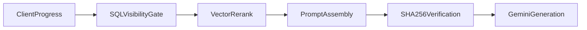

# Scene Assistant Runtime Architecture

> **Vocabulary Notice:** This document uses implementation symbols (`Scene`, `story_images_v2`, `caption`).
> Normative Runtime vocabulary is `Reading Route` (impl: Scene), `Reading Frame` (impl: Story Images), and
> `Frame Narrative` (impl: caption). See [`governance/vocabulary/runtime-lexicon.md`](https://github.com/raree-show-admin/governance/vocabulary/runtime-lexicon.md)
> in `raree-show-admin` for the authoritative Runtime vocabulary reference.

Raree Show is a narrative visualization and story interaction platform. The Scene Assistant is an AI-assisted scene runtime that answers questions about the reader's current position in a work — with **system-enforced spoiler boundaries**, not prompt-only instructions.

This document describes the **current deployed runtime**. For product-facing overview, see the [README](../README.md).

---

## End-to-end pipeline



Each Scene Assistant request carries committed reader progress (`userProgress`). The server treats that payload as authoritative for visibility boundaries on that turn.

| Stage | Responsibility |
|-------|----------------|
| Client progress | Commits `readUpToChapter`, `readUpToOrderIndex`, `sceneTsid`, `readUpToStoryIndexLast` before retrieval (see [W-01](specs/w-01-visibility-synchronized-navigation.md)) |
| SQL visibility gate | Builds the candidate scene set the reader may retrieve against |
| Vector rerank | Semantic ranking **only** within SQL-approved candidates |
| Prompt assembly | Truncates current-scene story captions to revealed slides |
| SHA-256 verification | Confirms authorized semantic bytes before any LLM call |
| Gemini generation | Single-provider streaming response via `@ai-sdk/google` |

---

## Serial Hybrid RAG topology

Hybrid RAG is a **mandatory two-stage serial pipeline**. There is no routing, no conditional fallback, and no path that runs vector search without SQL first.

```text
metadataPreFiltering (SQL) → match_scenes (vector rerank)
```

**SQL gate (`metadataPreFiltering`)** filters scenes by work and reading progress using lexicographic "read up to" semantics (`readUpToChapter`, `readUpToOrderIndex`). Only scenes at or before the reader's committed position enter the candidate set.

**Vector rerank (`match_scenes`)** runs pgvector similarity search **only** on tsids produced by the SQL gate. Vector retrieval cannot expand visibility beyond the SQL-approved set.

Implementation: [`src/services/retrieval.ts`](../src/services/retrieval.ts) (`metadataPreFiltering`, `retrieveScenes`).

Decision record: [ADR-002: Hybrid RAG with Two-Layer Visibility Boundary](adr/002-hybrid-rag-retrieval.md).

Vector store: [ADR-001: pgvector as vector store](adr/001-pgvector-as-vector-store.md).

---

## Two-layer visibility boundary

Spoiler isolation is enforced **independently of model compliance** — boundaries are system guarantees, not instructions asking the model to behave.

### Layer 1 — Retrieval visibility (SQL gate)

Constrains **which scenes** may enter hybrid search. Governed by `workTsid`, `readUpToChapter`, `readUpToOrderIndex`.

### Layer 2 — Prompt visibility (in-memory truncation)

Constrains **which narrative atoms** (slide captions from `story_images_v2`) become model-visible tokens for the **current scene**. Governed by `sceneTsid`, `readUpToStoryIndexLast`.

Layer 2 runs **after** retrieval completes. Prompt-side truncation does not add or remove scenes from the SQL-approved universe; it only limits caption text sent to the LLM.

Client sequencing that keeps `userProgress` aligned with the reader's position is specified in [W-01: Visibility-Synchronized Navigation](specs/w-01-visibility-synchronized-navigation.md).

---

## SHA-256 production oracle

Before any LLM invocation, the runtime verifies that the authorized semantic payload matches expectations.

**Production oracle** ([`src/lib/production-story-oracle.ts`](../src/lib/production-story-oracle.ts)):

- Collects raw UTF-8 caption bytes from `chapterScenes[].revealedStorySlides` only
- Scenes processed in ascending `order_index`; slides in array order
- Computes `sha256(authorizedSemanticBytes)` and verifies against the expected digest
- On mismatch: fails closed with `InvariantViolationError` — no LLM call

This gate ensures the bytes about to reach the model match the visibility boundary the server constructed.

### Production vs eval oracle serialization

The offline RAGAS harness uses a **different serialization** for dataset fixtures (`sha256(contexts.join("\n"))` on normalized context chunks). Production and eval hashes are **not interchangeable**.

| Context | Oracle authority | Serialization |
|---------|------------------|---------------|
| Production (Scene Assistant) | Gates LLM ingress | `sha256(concat raw caption UTF-8)` from revealed story slides |
| Eval v1 (`eval/ragas/`) | Offline dataset checks only | `sha256(normalized(contexts))` on fixture chunks |

See [`eval/ragas/README.md`](../eval/ragas/README.md) for eval topology and non-goals.

---

## Generation runtime (current truth)

**Deployed today:** a single Gemini path.

```text
retrieveVerifiedAssistantContext
        ↓
streamText() via @ai-sdk/google
        ↓
SceneAssistant UI (normalized text-delta / error events)
```

There is **no** multi-provider runtime, **no** OpenRouter integration, **no** transparent failover, and **no** provider-switch telemetry in production.

[ADR-003: Multi-Provider AI Runtime Topology](adr/003-multi-provider-ai-runtime.md) describes a **planned** generation-layer failover design. It is **not deployed**.

---

## Governance enforcement

Governance documents live in the `governance/` submodule (shared across repos). Local dev and CI ensure the mount is present and readable.

| Mechanism | Purpose |
|-----------|---------|
| `npm run bootstrap` | Initializes `governance/` submodule and syncs to latest |
| `npm run check:governance` | Verifies required governance entrypoints are accessible |
| `npm run dev` | Runs bootstrap via `predev` hook |
| PR workflow (`.github/workflows/pr-governance.yml`) | Bootstrap + governance check on pull requests |

Scripts: [`scripts/governance/`](../scripts/governance/).

This is **CI transport integrity** — not a runtime governance engine inside the Scene Assistant request path.

---

## Offline evaluation

The RAGAS harness under `eval/ragas/` provides specification-first **offline** evaluation of retrieval governance and semantic quality.

```bash
npm run eval:ragas          # full suite (requires GEMINI_API_KEY for semantic metrics)
npm run eval:ragas:oracle   # oracle-only, no LLM
```

**What it covers:**

- Content-hash oracle (spoiler violation detection)
- Faithfulness, answer relevancy, context precision (LLM judge, when API key present)

**Explicit non-goals (v1):**

- CI gating or merge blocking
- Live Supabase hydration during eval
- Dashboards or trending

Spec: [`docs/specs/ragas-evaluation-suite.md`](specs/ragas-evaluation-suite.md).

---

## Runtime truth vs planned

| Capability | Status |
|------------|--------|
| Hybrid RAG serial retrieval (SQL → vector) | **Deployed** |
| SQL visibility gate | **Deployed** |
| Bounded vector rerank on SQL output | **Deployed** |
| SHA-256 visibility verification before LLM | **Deployed** |
| Prompt-level story caption truncation | **Deployed** |
| Single-provider Gemini generation | **Deployed** |
| Governance CI checks (submodule mount) | **Deployed** |
| Offline RAGAS harness | **Deployed** (manual / local) |
| Provider abstraction | **Planned** (ADR-003) |
| Transparent generation failover | **Planned** (ADR-003, not deployed) |
| Runtime provider-switch telemetry | **Planned** |
| Evaluation CI automation / gating | **Planned** |
| Intelligent model routing | **Out of scope** |

---

## References

### ADRs

- [ADR-001: pgvector as vector store](adr/001-pgvector-as-vector-store.md)
- [ADR-002: Hybrid RAG with Two-Layer Visibility Boundary](adr/002-hybrid-rag-retrieval.md)
- [ADR-003: Multi-Provider AI Runtime Topology](adr/003-multi-provider-ai-runtime.md) — planned, not deployed

### Key source

| Path | Role |
|------|------|
| `src/services/retrieval.ts` | Serial retrieval, oracle ingress |
| `src/lib/production-story-oracle.ts` | SHA-256 production oracle |
| `src/lib/visibility-invariant.ts` | Progress field invariants |
| `src/app/api/scene-assistant/route.ts` | API route, Gemini streaming |
| `src/components/raree/ReadingRouteExperience.tsx` | Client navigation + progress commit |
| `src/components/raree/ReadingRouteAssistant.tsx` | Streaming UI |

### Specs

- [W-01: Visibility-Synchronized Navigation](specs/w-01-visibility-synchronized-navigation.md)
- [RAGAS Evaluation Suite](specs/ragas-evaluation-suite.md)
